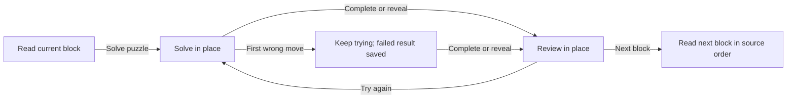

# Feature specification: Continuous reading, solving, and review

Date: 2026-10-02. Status: implemented; initial automated acceptance passed;
space refinement runtime checks and physical-device review pending.

Request: simplify puzzle entry, controls, context, rejection feedback, and
variation review around the learner's existing place in a book.

This feature extends feature 001. The user authorized implementation on
2026-10-02, including shared cycle-solving improvements and Luna delegation. See
[research.md](research.md), [plan.md](plan.md), [contracts/study-flow.md](contracts/study-flow.md),
and [tasks.md](tasks.md).

## Intended experience

The learner stays in one study screen: read a block, choose **Solve puzzle**,
solve or fail, inspect the review, then choose **Next block**. That next block
may be a puzzle, explanatory text, or a game. Book position remains the anchor
through all these changes.

Failure does not force disclosure. The learner can keep trying with the
solution hidden or choose **Show solution** to enter review immediately.

## Prioritized user stories

### US1 — Start solving directly, in context (P1)

As a reader, I want Solve puzzle to begin solving the current puzzle immediately
so that I can keep studying without interpreting a menu of book preferences.

Acceptance scenarios:

1. Given a puzzle in reading mode, when Solve puzzle is selected once, the
   same screen displays its starting position and accepts puzzle moves. No
   chooser, policy form, or additional route intervenes.
2. The header retains book name, available section, and block identity. Casual
   practice is a subtitle. Side to move appears as centered text below the
   board until the first move attempt, with an explicit screen-reader label
   retained throughout play. There is no visible turn dot or side gutter.
3. Solving starts at the authored initial position even if the reader was
   inspecting a later move. Reading position and scroll are saved separately.
4. If the reader has already exposed this puzzle's answers, starting practice
   conceals them again and retains answer-exposure provenance internally. The
   surface remains labeled Casual practice; no banner implies an explicit
   solution reveal merely because reading made the line available.
   It never presents that interaction as a fresh unseen assessment.
5. Starting or restoring fails: retain the current reading surface and offer
   Retry without losing its position or creating duplicate attempts.

### US2 — Use essential controls without scrolling (P1)

As a learner, I want the action I need next to remain visible while I read
notes or move history.

Acceptance scenarios:

1. Solve puzzle, Hint, Show solution, and Next block are accessible in their
   respective states without scrolling the content panel.
2. Solving exposes Hint and Show solution in a fixed action region. Show move
   is available as a contextual secondary action after a hint. Pause, Skip,
   board orientation, and book preferences use compact secondary controls.
3. Review keeps move navigation near the board and Next block in the fixed
   action region, even with long notes and many variations.
4. At 360 × 640 and 412 × 915 logical pixels, landscape 640 × 360, and text
   scale 2.0, controls fit, remain reachable, and have targets at least 48 × 48.
   Adaptive geometry can shrink the board to reserve control space.
   Cycle metadata belongs in the app bar title/subtitle; mode and the session
   clock retain visible slots. Pause/resume uses one labeled icon action.
5. Pending saves disable conflicting actions and communicate progress. A
   failed save retains the durable position and exposes Retry in place.

### US3 — Understand mistakes and their rejection (P1)

As a learner, I want to see the different wrong moves I tried, including after
the first failure, and understand the piece returning to its original square.

Acceptance scenarios:

1. At one authored position, rejected moves A, B, A, C, B retain A, B, C in
   first-seen order. Deduplication compares every earlier rejection at that
   position, rather than only the immediately preceding move.
2. A repeated move still shows rejection feedback and the board returns
   correctly; it adds no duplicate history entry or distinct-mistake count.
3. The same UCI move at a different authored position is a distinct mistake.
   Promotion choices and wrong opponent predictions follow the same rule.
4. The first error finalizes the scored attempt as wrong_move. Subsequent
   distinct mistakes persist as practice history without altering the saved
   score, outcome, timing, or aggregate cycle metrics.
5. After a legal rejected move, its destination remains visible briefly,
   feedback appears, and the piece visibly returns. Further input is locked
   until the transition finishes. Reduced motion uses a brief static cue.
6. Restart after A, B still ignores another A and records C. Try again starts
   a new attempt with fresh mistake deduplication.
7. Invalid UCI and unsubmitted illegal gestures remain input validation
   events, not scored mistakes. Submitted illegal moves retain existing
   failure semantics without displaying an impossible temporary position.

Interpretation of “not mattering the order”: repetition means the same move
from the same position within an attempt, including interleaved submissions.
It does not mean ignoring that move in every later position or fresh attempt.

### US4 — Review a solution without losing the thread (P1)

As a learner, I want to follow the line I played and its alternatives beside
the same board, then continue through the book when I am ready.

Acceptance scenarios:

1. Completion or Show solution changes the current study surface to review
   without pushing a route or moving the learner to another block.
2. Review begins at the reached accepted position and selected branch, keeps
   orientation, and shows the saved outcome as an informational icon beside
   move navigation. Tooltip and screen-reader labels distinguish passed,
   failed, assisted, revealed, skipped, timed out, and abandoned states;
   color is not the only cue. A failed attempt completed later
   says **Completed in practice · First attempt failed**.
3. The accepted path is distinguished from **Your tries**, which includes the
   distinct rejected moves. Rejected moves do not become playable solution
   variations.
   Your tries uses informational text, not chips or move-navigation controls.
   Consecutive solution moves share compact wrapping rows; comments and
   alternatives retain their branch-point association. Move targets remain
   at least 48 × 48. Selected state is conveyed on the move and through board
   semantics instead of a separate "Selected move" caption.
4. Alternatives appear at their actual branch points with real chess move
   numbers, e.g. **Alternative at 12...**, indentation, and expand/collapse
   controls. Selecting an alternative highlights it and updates the board.
5. Nested alternatives remain identifiable. Back from an alternative returns
   to its branch point; a Return to played line action restores that line.
6. Comments and annotations appear beside their associated move; the selected
   move stays visible. Introductory notes are shown directly in the scrollable
   review, without a Puzzle notes heading or expand step. Solution line and
   ply-count labels remain in semantics without occupying visual rows.
7. Next block opens the adjacent source block, including non-puzzles, without
   automatic progression on completion. At the last block it becomes **Back
   to book**. Previous block is disabled at the first block.

### US5 — Set preferences without interrupting study (P2)

As a reader, I want book-wide defaults to be separate from my action on the
current puzzle.

Acceptance scenarios:

1. Book settings contains **Open puzzles: Read / Solve**. Choosing Solve
   puzzle on the current block does not change that preference.
2. Missing preference defaults to Read. Previously saved preferences remain
   respected. With Read selected, Next block opens a puzzle for reading and
   offers Solve puzzle; with Solve selected, a new puzzle starts in place.
3. Completion policy uses the existing marker-aware default. Its adjustment
   is in secondary practice settings, affects new attempts, and never blocks
   entry or alters an existing attempt or a cycle's frozen policy.
4. Explicit cycle training retains its set order, progress, timing, scoring,
   and Finish cycle semantics. Review continuation says Next exercise and
   fills its available action row. Casual practice creates no real cycle/session
   rows and contributes nothing to cycle reports.

## Functional requirements

| ID | Requirement |
| --- | --- |
| CS-001 | Maintain one book study route across reading, solving, and review; keep stable block identity. |
| CS-002 | Solve puzzle directly starts/restores this block's interaction in place; no intermediate preference selection. |
| CS-003 | Keep essential state-specific actions outside scrollable content with accessible labels and visible busy/error states. |
| CS-004 | Display book, available section, neutral block identity, mode, and side to move; conceal solution-bearing metadata. |
| CS-005 | Retain all distinct rejected submissions by attempt + authored position + normalized UCI, in first-seen order. |
| CS-006 | Persist distinct practice mistakes separately from the immutable scored attempt. |
| CS-007 | Make rejection perceptible before returning the piece; serialize input and honor reduced motion. |
| CS-008 | Review the reached accepted branch in place, with contextual alternatives, annotations, and separate user tries. |
| CS-009 | Next/Previous block use adjacent source order independent of filters; preserve current interaction before leaving. |
| CS-010 | Isolate book defaults, completion policy, and cycle training from a current-block solve action. |
| CS-011 | Preserve reading cursor, accepted practice cursor, review cursor, branch selection, and orientation independently. |
| CS-012 | Track answer exposure for casual practice; retries are new attempt identities and never overwrite results. |

## Failure and edge behavior

Leaving an unfinished attempt pauses and saves it. Failed practice saves its
cursor without reopening scoring. Next, Previous, Back, reveal, and retry wait
for durable transitions; on failure remain on the current block. Process
termination during rejection restores the accepted position, never a transient
rejected board. No replay of the rejection delay is required on restart.

Returning to a block with an unfinished interaction restores it when Solve is
selected. If it already has a reviewed terminal interaction, Solve restores
review with Try again available; it does not silently create a new assessment.
Read is available after completion or explicit Show solution, restoring the
saved reading cursor. Imported text and authored variations remain concealed
during active solving and continued failed practice. An explicit classification
change to reading finalizes any unfinished attempt before revealing content.
Returning to solving after reveal cannot restore scoring eligibility.

Missing section: show the book and block identifier; never invent a section.
Unsupported or missing next content: show an actionable explanation in the
study screen and retain access to adjacent block controls without erasing
history. Empty/source boundary cases have explicit disabled controls.

## Success criteria

- One activation from reading to an interactive current-puzzle board.
- Zero additional navigation routes for solve and review; zero automatic
  block advances when a puzzle completes.
- Zero content-scroll gestures required for the essential controls in US2.
- A, B, A, C, B produces exactly three distinct mistakes at that position,
  including across restart, while the scored attempt remains unchanged.
- Both main-line and nested-variation review support selecting a move,
  inspecting its comment, returning to the played line, and continuing to a
  non-puzzle block without losing book position.
- Target rejection cue: 450 ms hold and approximately 200 ms return, with
  reduced-motion static feedback; tune only after physical-device review.

## Baseline changes and scope

On adoption, reconcile 001's FR-023 and puzzle-evaluation contract, which
currently suppress every subsequent rejected entry, with CS-005/006. Extend
FR-019a, FR-020/025, FR-026d and scenarios 6a/8a/11 with the in-place flow.
Retain deterministic authored acceptance, first-error finalization, append-only
scored history, and no cycle impact from casual practice.

Deferred: engines, move equivalence, new scoring formulas, training scheduler,
whole-book puzzle batches, import redesign, automatic section inference from
arbitrary legacy titles/comments, and redesign of progress reports/set builder.
